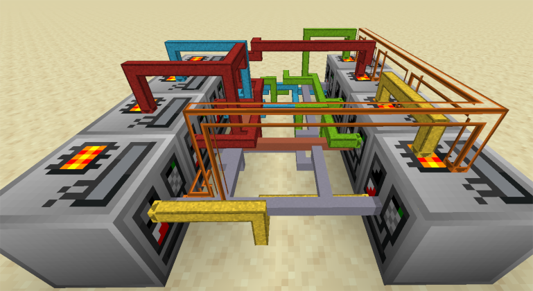

---
navigation:
  title: "Introduction"
  icon: "modern_industrialization:guidebook"
---

# Modern Industrialization
Welcome to **Modern Industrialization**!

## Introduction
Modern Industrialization is a mod about automation! It means that, at some point, any resource can (and should) be automated.

The progression is split between the **Steam Age** (early game) and the rest. In the Steam Age, you will create your first factories that will produce the resources needed for the second part. The challenge of this stage comes from the resource management and processing time optimization.

Be aware that most setups will become obsolete once you finish the Steam Age, so don't invest too much effort in them.

The second part of the progression is the **Electric Age**. At this stage, you are strongly encouraged to automate every processing line.

The setups you build at this stage are expected to be permanent as they can be continuously upgraded. The overclock system for electric machines will mean that your production will automatically adapt to your consumption.

The challenge will come from building efficient and balanced processing lines, and prioritizing the most useful ones.

The full power of the Electric Machines is reached when they operate continuously. That is why it is STRONGLY DISCOURAGED to use Modern Industrialization in unison with an On-Demand Automation Mod like AE2 or Refined Storage as it will make your progress extremely slow and inefficient.
